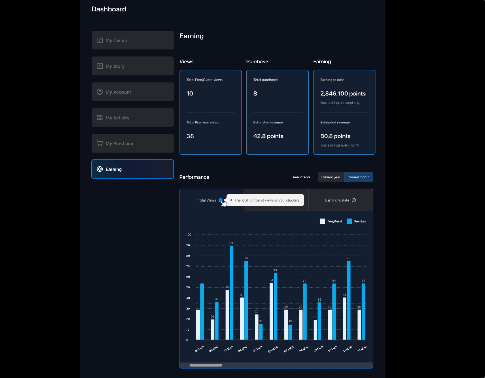

# 🚀 TADA v2 – Fintech Monetization Ecosystem Transformation Case Study

*A real project where I worked as a Business Analyst → Product Owner to transform a content platform into a fintech-based monetization ecosystem.*

---

## 📑 Table of Contents

1. [Problem Statement & Current State](#part-1-problem-statement--current-state-analysis)  
2. [Goals & Success Measures](#part-2-goals-alignment--success-measures)  
3. [Proposed Solution & Future State](#part-3-proposed-solution--future-state)  
4. [Stakeholder Analysis](#part-4-stakeholder-analysis)  
5. [Gap List, Requirements & Business Logic](#part-5-gap-list-requirements--business-logic)  
6. [System, Data & Revenue Architecture](#part-6-system-data--revenue-architecture)  
7. [Execution, UAT & Dashboard Delivery](#part-7-execution-uat--dashboard-delivery)  
8. [Tools & Methods](#part-8-tools--methods-used)  
9. [Key Deliverables](#part-9-key-deliverables-created)  
10. [Outcomes](#part-10-outcomes)  
11. [Learnings & Reflection](#part-11-key-learnings--reflection)  

---

# Part 1: Problem Statement & Current State Analysis

TADA v2 is a **9-month transformation (Jul 2024–Apr 2025)** to rebuild a Vietnamese content platform (webtoon/novel) into a **fintech-powered monetization ecosystem** backed by Indonesian investors.

### ⚠️ Key AS-IS Challenges
- Platform offered **no monetization** (free read–upload–react only)  
- **No revenue engine** for creators/users  
- **Manual Excel-based reporting** for investors → inconsistent, error-prone  
- Zero transparency across content, revenue, and creator performance  
- Low engagement due to no incentive/referral system  
- No wallet architecture, no automated revenue settlement  
- Fragmented data → not suitable for scalable growth  

### 🔎 AS-IS Snapshot

*Figure 1: AS-IS Process Flow (Manual reporting, no revenue logic)*  

✨ This analysis revealed the need for a structured monetization engine, wallet system, and data transparency layer.

🔗 [Back to TOC](#-table-of-contents)

---

# Part 2: Goals, Alignment & Success Measures

### 🎯 Key Goals

1. Build **7 revenue streams**, automated end-to-end  
2. Launch **bilingual (EN/VN) revenue dashboards** for investors/creators  
3. Automate **90%** of revenue calculation & wallet settlement  
4. Achieve **25% increase** in creator retention  
5. Reduce monthly reporting time from **2–3 days → real-time**  
6. Introduce a **configurable Revenue Rule Matrix** editable without engineering  
7. Enable full **auditability & traceability** of revenue actions  

### 📈 KPIs & Success Measures
- 90% of revenue flows automated  
- 50% fewer revenue-related support tickets  
- Real-time earnings update  
- 100% bilingual investor reporting  
- 0% manual Excel dependencies  

✨ These KPIs guided design, backlog prioritization, and investor alignment.

🔗 [Back to TOC](#-table-of-contents)

---

# Part 3: Proposed Solution & Future State

### 💡 My Approach
- Re-designed monetization architecture  
- Introduced wallet-based settlement  
- Built configurable revenue rules  
- Designed real-time dashboards  
- Mapped TO-BE flows for all 7 revenue streams  

### 🌟 Proposed Solution Highlights
- **Fintech-grade Wallet System**  
- **Revenue Engine** (configurable split rules)  
- **Real-Time Earning Dashboard**  
- **Referral & Incentive Framework**  
- **Fraud Prevention Logic**  
- **Event-driven updates (WebSocket + Redis)**  

### 📦 Future State Architecture

*Figure 2: TO-BE BPMN – Wallet, Revenue Engine & Settlement*

🔗 [Back to TOC](#-table-of-contents)

---

# Part 4: Stakeholder Analysis

Strong alignment between Vietnam team and Indonesian investors was critical.

### 👥 Key Stakeholders
- **Investors (ID)** – high influence, transparency required  
- **CEO / Product Leadership** – key decision makers  
- **Tech Lead & Engineers** – development & integration  
- **Creators** – monetization beneficiaries  
- **Finance** – compliance & auditing  

### 📌 Tools:
- Stakeholder Register  
- RACI Matrix  
- Communication Plan  

*Figure 3: RACI Matrix*

🔗 [Back to TOC](#-table-of-contents)

---

# Part 5: Gap List, Requirements & Business Logic

### 🕳️ Gap List (12 Items)
Examples:
- No wallet system  
- Manual reporting  
- No automated revenue sharing  
- No configurable revenue rules  
- No audit trail  

📄 Artifact:  
- [06_Gap List.pdf](./06_Gap%20List.pdf)

### 📘 Requirements Documents
- BRD (Full)  
- Key Requirement Table (MoSCoW)  

📄 Artifacts:  
- [02_BRD.pdf](./02_BRD.pdf)  
- [07_Key Requirement table -BRD.pdf](./07_Key%20Requirement%20table%20-BRD.pdf)

🔗 [Back to TOC](#-table-of-contents)

---

# Part 6: System, Data & Revenue Architecture

### 🧠 Revenue Rule Matrix  
Defines revenue splits for 7 streams.

📄 [09_Revenue_Rule_Matrix.pdf](./09_Revenue_Rule_Matrix.pdf)

### 🗂 Data Mapping Table  
Maps all monetization entities.

📄 [10_Data_Mapping_Table.pdf](./10_Data_Mapping_Table.pdf)

### 🔄 Data Flow Diagram  
Shows event → engine → wallet → dashboard flow.

📄 [11_Data_Flow_Diagram.pdf](./11_Data_Flow_Diagram.pdf)

🔗 [Back to TOC](#-table-of-contents)

---

# Part 7: Execution, UAT & Dashboard Delivery

### 📌 Execution Highlights
- Weekly team syncs  
- Bi-weekly investor reviews  
- Continuous backlog refinement & sprint planning  
- Design + tech alignment meetings  

### 🧪 UAT Results
- 90% automation validated  
- Revenue engine accuracy confirmed  
- Settlement logic tested for edge cases  

### 📊 Earning Dashboard

📄 [Dashboard PDF](./14_UI_Dashboard_Earning_01a.pdf)

🔗 [Back to TOC](#-table-of-contents)

---

# Part 8: Tools & Methods Used

- **Documentation**: Confluence, Google Docs  
- **Modeling**: Draw.io, Miro  
- **Collaboration**: Jira, Zoom  
- **Architecture**: Redis, WebSocket  
- **Payment**: Momo / ZaloPay API  
- **Dashboard**: Internal BI Layer  

🔗 [Back to TOC](#-table-of-contents)

---

# Part 9: Key Deliverables Created

| Artifact | File |
|---------|------|
| Project Charter | [01_Project_Charter.pdf](./01_Project_Charter.pdf) |
| BRD | [02_BRD.pdf](./02_BRD.pdf) |
| Stakeholder Register | [03_Stakeholder_Register.pdf](./03_Stakeholder_Register.pdf) |
| Pain Point Table | [04_Pain_Point.pdf](./04_Pain_Point.pdf) |
| AS-IS Diagram | [05_AS-IS_Diagram.pdf](./05_AS-IS_Diagram.pdf) |
| GAP List | [06_Gap List.pdf](./06_Gap%20List.pdf) |
| Key Requirement Table | [07_Key Requirement table -BRD.pdf](./07_Key%20Requirement%20table%20-BRD.pdf) |
| TO-BE BPMN | [08_Future State Solution (TO-BE BPMN).pdf](./08_Future%20State%20Solution%20(TO-BE%20BPMN).pdf) |
| Revenue Rule Matrix | [09_Revenue_Rule_Matrix.pdf](./09_Revenue_Rule_Matrix.pdf) |
| Data Mapping Table | [10_Data_Mapping_Table.pdf](./10_Data_Mapping_Table.pdf) |
| Data Flow Diagram | [11_Data_Flow_Diagram.pdf](./11_Data_Flow_Diagram.pdf) |
| RACI Matrix | [12_RACI_Matrix.pdf](./12_RACI_Matrix.pdf) |
| Communication Plan | [13_Communication_Plan.pdf](./13_Communication_Plan.pdf) |
| Dashboard (PDF) | [14_UI_Dashboard_Earning_01a.pdf](./14_UI_Dashboard_Earning_01a.pdf) |

🔗 [Back to TOC](#-table-of-contents)

---

# Part 10: Outcomes

### ✔ Business
- Moved from **zero monetization → fintech ecosystem**  
- Transparent, bilingual reporting for investors  
- Scalable foundation for SEA expansion  

### ✔ Product
- 7 revenue streams  
- Wallet & revenue engine  
- Real-time earnings dashboard  

### ✔ Operations
- 90% automation  
- Reporting time reduced from 2 days → instant  

🔗 [Back to TOC](#-table-of-contents)

---

# Part 11: Key Learnings & Reflection

- Cross-country stakeholder management (VN ↔ Indonesia) requires clarity & cadence  
- Configurable revenue architecture reduces dev cost  
- Data modeling is central to monetization flows  
- Visual diagrams accelerate alignment  
- A BA becomes a PO when focused on **value delivery**, not just documentation  

✨ This project strengthened my ability to bridge **business + fintech + product strategy**.

---

