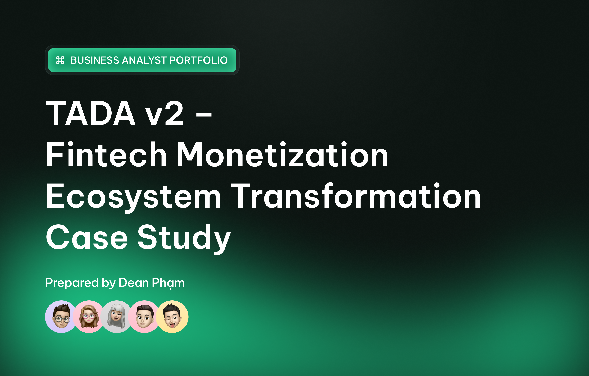
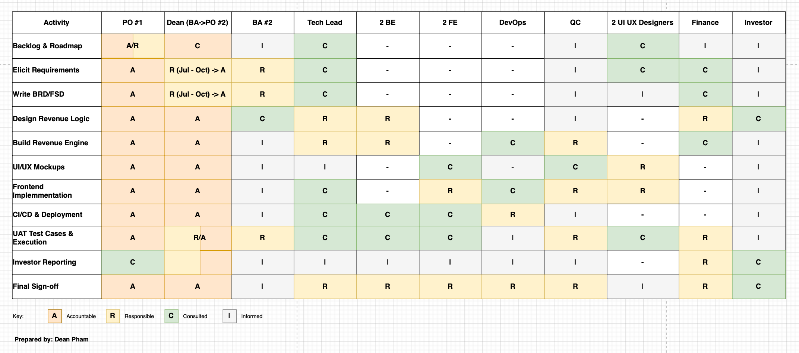
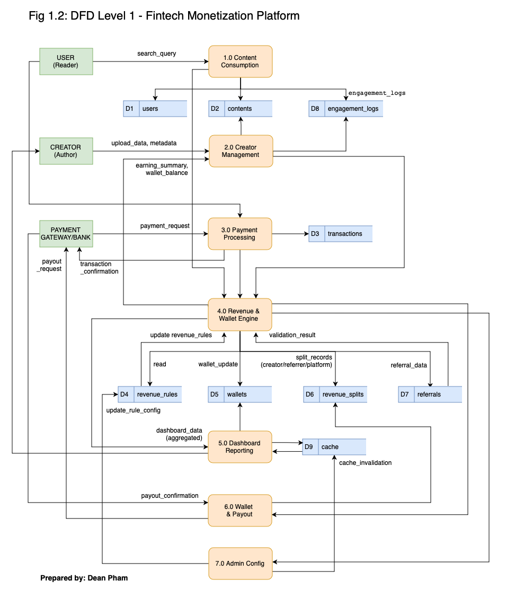

# 🚀 TADA v2 – Fintech Monetization Ecosystem Transformation Case Study

  

*A real project where I worked as a Business Analyst → Product Owner to transform a content platform into a fintech-based monetization ecosystem.*

---

## 📑 Table of Contents

1. [Problem Statement & Current State](#part-1-problem-statement--current-state-analysis)  
2. [Goals & Success Measures](#part-2-goals-alignment--success-measures)  
3. [Proposed Solution & Future State](#part-3-proposed-solution--future-state)  
4. [Stakeholder Analysis](#part-4-stakeholder-analysis)  
5. [Gap List, Requirements & Business Logic](#part-5-gap-list-requirements--business-logic)  
6. [System, Data & Revenue Architecture](#part-6-system-data--revenue-architecture)  
7. [Execution, UAT & Dashboard Delivery](#part-7-execution-uat--dashboard-delivery)  
8. [Tools & Methods](#part-8-tools--methods-used)  
9. [Key Deliverables](#part-9-key-deliverables-created)  
10. [Outcomes](#part-10-outcomes)  
11. [Learnings & Reflection](#part-11-key-learnings--reflection)  

---

# Part 1: Problem Statement & Current State Analysis

TADA v2 is a **9-month transformation** project to rebuild a Vietnamese content platform into a **fintech-powered monetization ecosystem**.

### ⚠️ Key AS-IS Challenges
- No monetization  
- No revenue engine  
- Manual Excel reporting  
- No transparency  
- No incentive/referral logic  
- No wallet system  
- Fragmented data  

### 🔎 AS-IS Snapshot

  

*Figure 1: AS-IS Process Flow*  

🔗 [Back to TOC](#-table-of-contents)

---

# Part 2: Goals, Alignment & Success Measures

### 🎯 Key Goals
- Build 7 revenue streams  
- Launch bilingual dashboards  
- 90% automation  
- 25% increase creator retention  
- Real-time reporting  
- Configurable Revenue Rule Matrix  
- Auditability & traceability  

### 📈 KPIs
- 90% automated flows  
- 50% fewer tickets  
- Real-time insights  
- 100% bilingual  
- 0% Excel dependency  

🔗 [Back to TOC](#-table-of-contents)

---

# Part 3: Proposed Solution & Future State

### 🌟 Proposed Solution Highlights
- Wallet system  
- Revenue engine  
- Real-time dashboard  
- Incentive & referral logic  
- Fraud prevention  
- WebSocket + Redis  

### 📦 Future State Architecture

  

*Figure 2: TO-BE BPMN*

🔗 [Back to TOC](#-table-of-contents)

---

# Part 4: Stakeholder Analysis

  

*Figure 3: RACI Matrix*  

🔗 [Back to TOC](#-table-of-contents)

---

# Part 5: Gap List, Requirements & Business Logic

### 📘 Requirements
- BRD  
- Key Requirement Table  
- Gap List  

🔗 [Back to TOC](#-table-of-contents)

---

# Part 6: System, Data & Revenue Architecture

### 🔄 Data Flow Diagram

  

*Figure 4: Level-1 DFD*

🔗 [Back to TOC](#-table-of-contents)

---

# Part 7: Execution, UAT & Dashboard Delivery

### 📊 Earning Dashboard Screens

  

📄 Dashboard (PDF):  
[14_UI_Dashboard_Earning_01a.jpg](./14_UI_Dashboard_Earning_01a.jpg)

🔗 [Back to TOC](#-table-of-contents)

---

# Part 8: Tools & Methods Used
- Jira, Confluence  
- Figma, Miro  
- Redis, WebSocket  
- Momo, ZaloPay API  

🔗 [Back to TOC](#-table-of-contents)

---

# Part 9: Key Deliverables Created

(You can keep your existing deliverables table here)

🔗 [Back to TOC](#-table-of-contents)

---

# Part 10: Outcomes
- Zero → 7 revenue streams  
- Wallet & revenue engine built  
- Real-time dashboards  
- Automation from days → instant  

---

# Part 11: Key Learnings & Reflection
- VN ↔ Indonesia stakeholder management  
- Configurable revenue architecture  
- Data-driven monetization  
- BA → PO transition  

---

